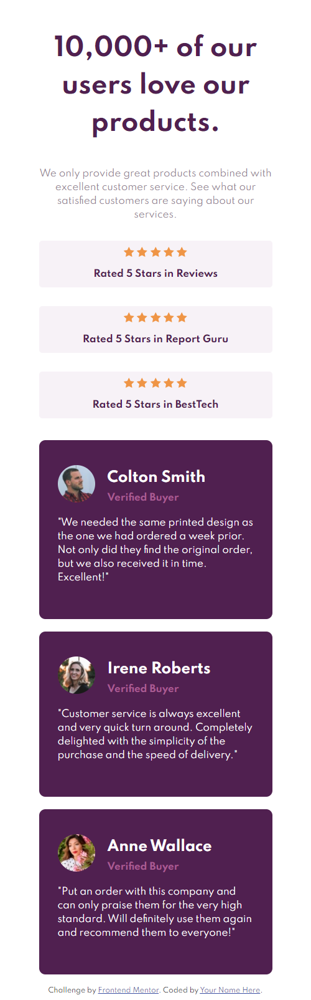

# Frontend Mentor - Social proof section solution

This is a solution to the [Social proof section challenge on Frontend Mentor](https://www.frontendmentor.io/challenges/social-proof-section-6e0qTv_bA). Frontend Mentor challenges help you improve your coding skills by building realistic projects. 

## Table of contents

- [Overview](#overview)
  - [The challenge](#the-challenge)
  - [Screenshot](#screenshot)
  - [Links](#links)
- [My process](#my-process)
  - [Built with](#built-with)
  - [What I learned](#what-i-learned)
  - [Continued development](#continued-development)
  - [Useful resources](#useful-resources)
- [Author](#author)
- [Acknowledgments](#acknowledgments)

## Overview

### The challenge

Users should be able to:

- View the optimal layout for the section depending on their device's screen size

### Screenshot

### Links

- Solution URL: [Social Proof Section Github](https://github.com/atharvpote/Social-Proof-Section)
- Live Site URL: [Social Proof Section](https://atharvpote.github.io/Social-Proof-Section/)

## My process

### Built with

- Semantic HTML5 markup
- CSS custom properties
- Flexbox
- CSS Grid
- Mobile-first workflow

### What I learned

- Design
- Structure and Layout
- Workflow

### Continued development

- CSS Flexbox
- CSS Grid

### Useful resources

- [MDN](https://developer.mozilla.org/en-US/) - This helped me to understand many HTML and CSS peoperties in detail.

## Author

- Frontend Mentor - [@atharvpote](https://www.frontendmentor.io/profile/atharvpote)
